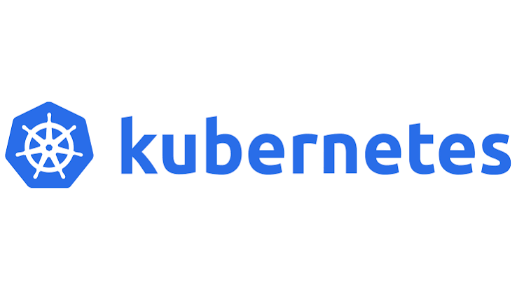

# Learning Kubernetes (K8s)

A collection of simple, easy-to-understand notes from my journey learning Kubernetes from scratch. Follow along if you're trying to wrap your head around clusters, pods, nodes, and deployments!

## 📂 What's in this repo?

My notes are organized into phases as I progress through my learning:

- **[Phase 1](./phase-1/)**: The absolute basics! Core concepts, `kubectl`, Pods, and Deployments.
  - [Core Concepts](./phase-1/01.core-concepts.md)
  - [Kubectl and API](./phase-1/02.kubectl-and-api.md)
  - [Deployments and ReplicaSets](./phase-1/03.deployments-and-replicasets.md)
  - [Reconciliation Loop](./phase-1/04.reconciliation-loop.md)
  - [Labels and Selectors](./phase-1/05.labels-and-selectors.md)
  - [Why Pods Exist](./phase-1/06.why-pods-exist.md)
  - [How Containers Share One IP](./phase-1/07.how-containers-share-one-ip.md)
  - [Why K8s Have Namespaces](./phase-1/08.why-k8s-have-namespaces.md)
  - [Why K8s Services Exist?](./phase-1/09-why-k8s-services-exist?.md)
  - [Why K8s Needs DNS?](./phase-1/10.why-k8s-needs-dns?.md)
  - [Why ConfigMaps & Secrets Exists?](./phase-1/11.why-configmaps-secrets-exists?.md)
- **[Design Docs](./design-docs/)**: Visual diagrams and mental models to help understand Kubernetes architecture.
- _(More phases coming soon!)_

---

  

